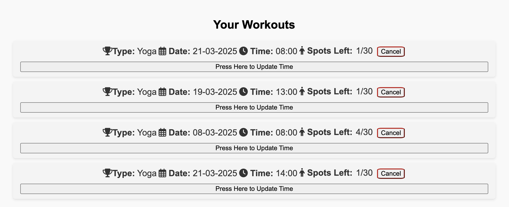

## Group 18

We built a website to help a gym manage their members and sign-ups for workouts. We have the option to sign in or sign up and reserve a workout easily.

User Guide:
1. The user starts at the homepage and then they sign in or sign up or browse the different trainers and workout types avaliable.

2. After creating an account they can browse the site or reserve a workout.

3. To reserve a workout the user needs to select a date, time and type of workout (Create). If the user isn't signed in or is already booked to a workout in the same date and time or if the workouts is full, up to 30 people per workout, an error message appears for each scenario.

4. When a user has workouts they appear on the same page (Read). For each workout there are details (date, time and type) and how many people have signed up (Count from DB).

5. A user can update (Update) or delete (Delete) their workouts.

6. When a workout has happened it is automatically deleted.